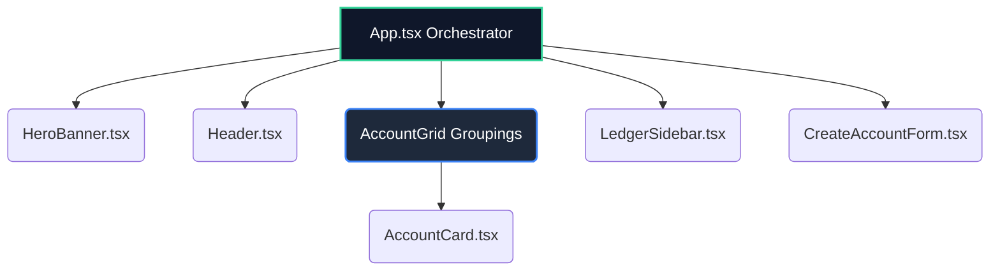

<div align="center">
  
# Money Tabs (Finance Tracker)
  
**Track, merge, and organize your wealth with elegance.**
  
  <p align="center">
    
    
    
    
  </p>

> A highly visual, drag-and-drop dashboard for tracking discrete sources of money (e.g., Bank Accounts, Wallets, Crypto). Merge tabs to view combined totals and audit your history with a beautiful glassmorphic ledger.

</div>

<br />

---

## Key Features

| Feature | Description |
| :--- | :--- |
| **Drag & Drop Merging** | Organize your tabs into combined groups. Drag a tab over another to create a merged <kbd>Group Total</kbd> view, making it easy to track distinct portfolios. |
| **Real-time Analytics** | See an interactive, responsive bar chart tracking your combined and individual balances, powered by `Recharts`. |
| **Audit History Ledger** | Never lose track of a manual adjustment. A sleek, slide-out glassmorphic drawer records every <kbd>Quick Add</kbd> and <kbd>Spend</kbd> transaction. |
| **Neumorphic & Glassmorphic UI** | Enjoy a premium dark-mode aesthetic with custom inner shadows, smooth gradients, and backdrop blurs. |
| **Local Persistence** | Your custom drag-and-drop layout arrangements are securely saved to your browser's `localStorage`. |

---

## Interface Preview

<details open>
  <summary><strong>Theme Details</strong></summary>
  <br/>
  <blockquote>
    The application utilizes a dark-slate theme <code>#151b2b</code> with vibrant emerald and teal accents to maximize focus and reduce eye strain.
  </blockquote>
</details>

- **Dashboard**: A gorgeous horizontal masonry grid holding your customized Money Tabs.
- **Ledger Sidebar**: A `backdrop-blur-3xl` glassmorphic drawer that slides in to reveal your financial activity trace.
- **Creator Panel**: Clean typography and inputs to spin up a new isolated *Place Tab* with preset icons.

---

## Architecture

Money Tabs is architected for speed and modularity:



### Tech Stack Highlights

- **Frontend Framework**: React 18 + Vite
- **Styling**: Tailwind CSS *(extensively utilizing arbitrary values for custom box-shadows)*
- **Icons**: `lucide-react`
- **Charting**: `recharts`

---

## Getting Started

### Prerequisites

Make sure you have [Node.js](https://nodejs.org/) installed along with `npm`, `yarn`, or `bun`.

### Installation

1. **Clone the repository**

   ```bash
   git clone https://github.com/your-username/finance-tracker.git
   cd finance-tracker
   ```

2. **Navigate to the Client Directory**

   ```bash
   cd client
   ```

3. **Install Dependencies**

   ```bash
   npm install
   # or bun install
   ```

4. **Start the Development Server**

   ```bash
   npm run dev
   # or bun run dev
   ```

5. **Open your browser** to `http://localhost:5173` *(or the port Vite provides)* and start tracking!

---

## Project Structure

<details>
  <summary><strong>Click to expand directory tree</strong></summary>

```text
client/
├── src/
│   ├── components/
│   │   ├── AccountCard.tsx        # Individual tab card with Quick Actions
│   │   ├── CreateAccountForm.tsx  # Module to generate new tabs
│   │   ├── Header.tsx             # Navbar & Stats
│   │   ├── HeroBanner.tsx         # Total aggregated balance & Recharts graphic
│   │   └── LedgerSidebar.tsx      # Slide-out glassmorphic transaction history
│   ├── types/
│   │   └── index.ts               # Core TS Interfaces (Account, Transaction)
│   ├── utils/
│   │   └── icons.ts               # Dynamic Lucide icon resolution
│   ├── App.tsx                    # Main state, drag-and-drop, and API orchestration
│   └── main.tsx                   # React DOM Entry
├── package.json
└── tailwind.config.js             # Contains custom brand colors and font settings
```
</details>

---

## License

This project is licensed under the **MIT License** - see the [LICENSE.md](./LICENSE.md) file for details.

<br />

<div align="center">
  <i>Built for better financial clarity.</i>
</div>
