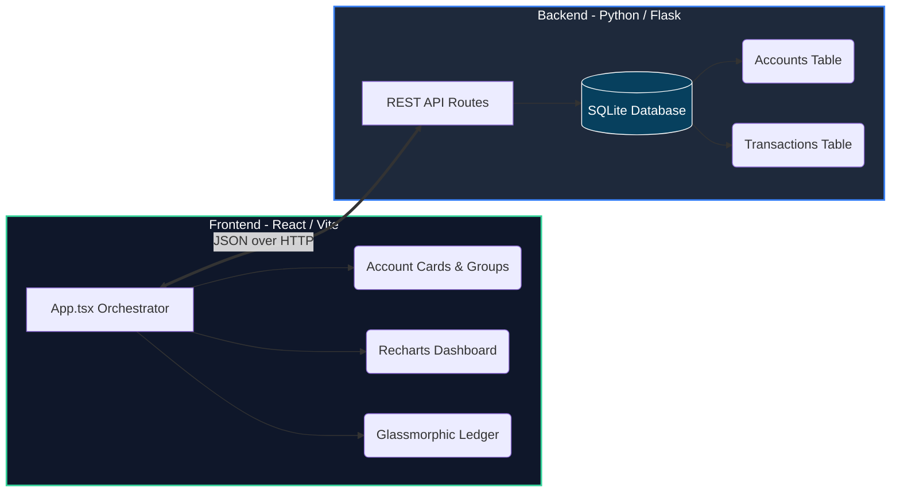

<div align="center">
  
# Money Tabs (Finance Tracker)
  
**Track, merge, and organize your wealth with full-stack elegance.**
  
  <p align="center">
    
    
    
    
    
    
  </p>

> A comprehensive, highly tactile dashboard for tracking discrete sources of money (e.g., Bank Accounts, Wallets, Crypto). Merge tabs to view combined totals on the frontend, securely persisted and orchestrated by a robust Python/Flask RESTful API with an immutable SQLite audit ledger.

</div>

<br />

---

## Key Features

| Feature | Description |
| :--- | :--- |
| **Drag & Drop Merging** | Organize your tabs into combined groups. Drag a tab over another to create a merged <kbd>Group Total</kbd> view, making it easy to track distinct portfolios. |
| **Real-time Analytics** | See an interactive, responsive bar chart tracking your combined and individual balances, powered by `Recharts`. |
| **Audit History Ledger** | Never lose track of a manual adjustment. A sleek, slide-out glassmorphic drawer records every <kbd>Quick Add</kbd> and <kbd>Spend</kbd> transaction. |
| **RESTful API Backend** | Fully persistent state management driven by a lightweight Flask backend operating on SQLite to ensure instantaneous updates and schema integrity. |
| **Neumorphic UI** | Enjoy a premium dark-mode aesthetic with custom inner shadows, smooth gradients, and backdrop blurs. |

---

## System Architecture

Money Tabs utilizes a decoupled client-server architecture designed for rapid iterations and strict state encapsulation:



### Backend API Endpoints

<details open>
  <summary><strong>Core API Routes Reference</strong></summary>
  <br />
  <table>
    <thead>
      <tr>
        <th>Method</th>
        <th>Endpoint</th>
        <th>Payload / Action</th>
      </tr>
    </thead>
    <tbody>
      <tr>
        <td><kbd>GET</kbd></td>
        <td><code>/api/accounts</code></td>
        <td>Fetches all isolated tracking tabs and their respective live balances.</td>
      </tr>
      <tr>
        <td><kbd>POST</kbd></td>
        <td><code>/api/accounts</code></td>
        <td>Validates and instantiates a new account entity with custom icons.</td>
      </tr>
      <tr>
        <td><kbd>POST</kbd></td>
        <td><code>/api/accounts/&lt;id&gt;/adjust</code></td>
        <td>Applies positive/negative increments, synchronously appending ledger trace lines.</td>
      </tr>
      <tr>
        <td><kbd>DELETE</kbd></td>
        <td><code>/api/accounts/&lt;id&gt;</code></td>
        <td>Permanently removes a place tab from persistent storage.</td>
      </tr>
      <tr>
        <td><kbd>GET</kbd></td>
        <td><code>/api/transactions</code></td>
        <td>Retrieves the immutable audit trail in reverse chronological order.</td>
      </tr>
      <tr>
        <td><kbd>DELETE</kbd></td>
        <td><code>/api/transactions/&lt;id&gt;</code></td>
        <td>Removes a trace row while automatically triggering inverse balance corrections.</td>
      </tr>
    </tbody>
  </table>
</details>

---

## Getting Started

### Prerequisites

Ensure you have the following installed on your machine:
- **Node.js** *(v18+ recommended)*
- **Python** *(v3.10+ recommended)*

---

### Backend Setup (Server)

1. **Navigate to the server directory**
   ```bash
   cd server
   ```

2. **Create and activate a virtual environment** *(Recommended)*
   ```bash
   python -m venv venv
   
   # On Windows:
   venv\Scripts\activate
   # On macOS/Linux:
   source venv/bin/activate
   ```

3. **Install Python Dependencies**
   ```bash
   pip install -r requirements.txt
   ```

4. **Launch the Flask API Server**
   ```bash
   python app.py
   ```
   > The backend will bootstrap the local SQLite database (`data.db`) automatically and listen on `http://localhost:5000`.

---

### Frontend Setup (Client)

1. **Open a new terminal window** and navigate to the client folder:
   ```bash
   cd client
   ```

2. **Install Node Dependencies**
   ```bash
   npm install
   ```

3. **Start the Vite Development Server**
   ```bash
   npm run dev
   ```

4. **Open your browser** to the localized URL provided by Vite *(typically `http://localhost:5173`)* to interact with the complete system.

> **Quick Launch Tip**: On Windows systems, you can also execute the included `start_tracker.bat` batch script from the root directory to spin up both the backend and frontend simultaneously.

---

## Project Structure

<details>
  <summary><strong>Click to view full repository layout</strong></summary>

```text
finance-tracker/
├── client/                      # Frontend Client Environment
│   ├── src/
│   │   ├── components/          # Extracted functional UI modules
│   │   │   ├── AccountCard.tsx
│   │   │   ├── CreateAccountForm.tsx
│   │   │   ├── Header.tsx
│   │   │   ├── HeroBanner.tsx
│   │   │   └── LedgerSidebar.tsx
│   │   ├── types/               # Shared TS Definitions
│   │   ├── utils/               # Dynamic icon resolvers
│   │   └── App.tsx              # Application layout controller
│   ├── package.json
│   └── tailwind.config.js
├── server/                      # Backend API Environment
│   ├── instance/
│   ├── app.py                   # Core Flask REST routing and SQLite schemas
│   └── requirements.txt         # Server packages (Flask, SQLAlchemy, CORS)
├── start_tracker.bat            # Automated combined startup helper
├── LICENSE.md
└── README.md
```
</details>

---

## License

This project is licensed under the **MIT License** - see the [LICENSE.md](./LICENSE.md) file for details.

<br />

<div align="center">
  <i>Engineered for complete fiscal transparency.</i>
</div>
